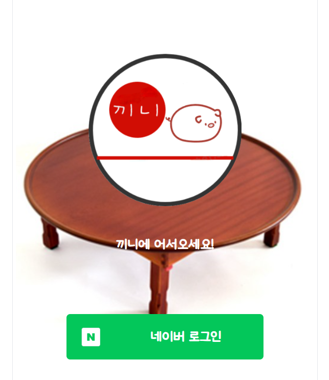
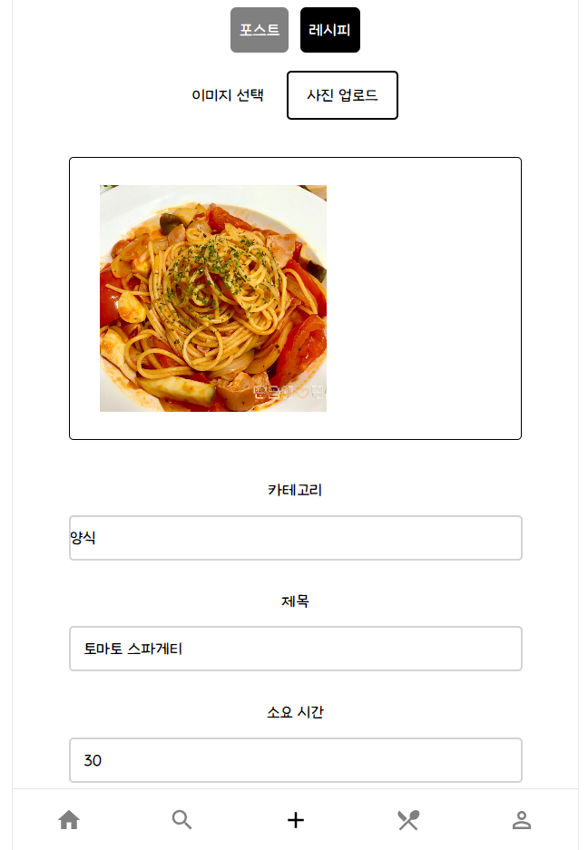
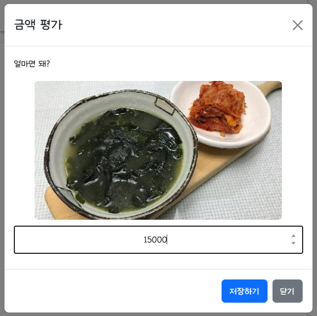
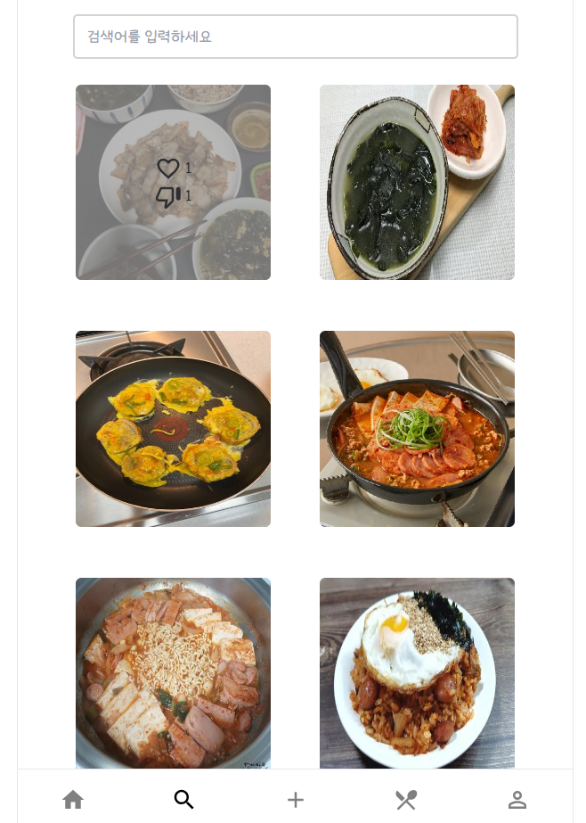
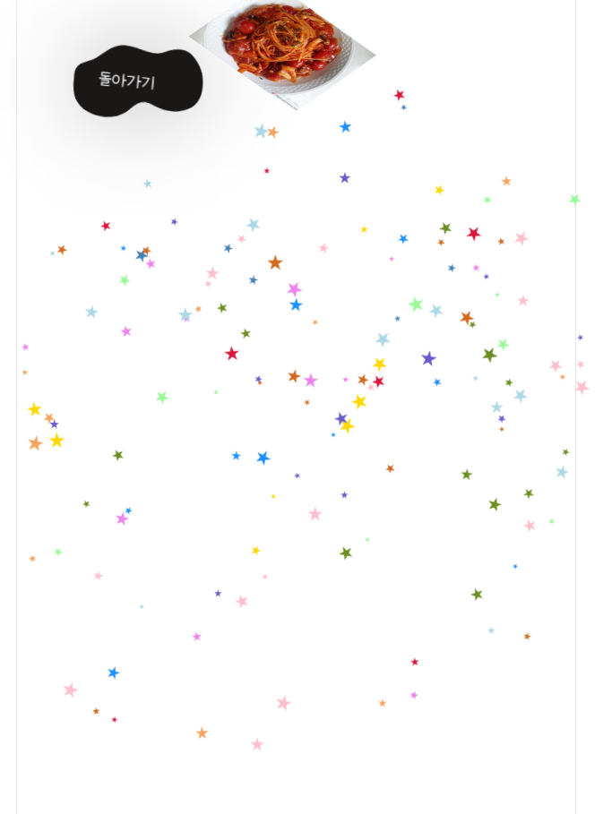
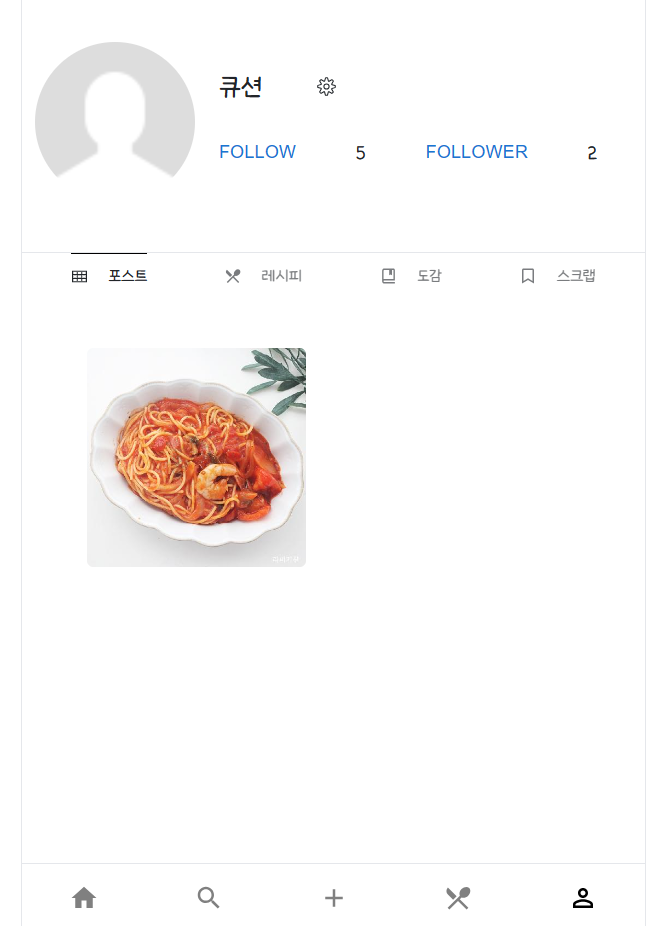

<div align="center">

# [Kkini🍴](https://i9c210.p.ssafy.io/) 


</div>

# 서비스 소개 🚩
* 자취 요리 가이드 및 공유 SNS 서비스입니다.
* 일상의 가장 가까운 부분인 식사를 공유하며 공감대를 형성하고 싶어 개발을 시작했습니다.
* 치솟는 물가에 허덕이는 주머니 사정을 지킬 수 있습니다!
* 당신의 요리 실력을 뽐내보세요!

# 개발 기간 🏁
* 7/4 ~ 8/17 (7주)

# 사용 기술
## FrontEnd

  


## BackEnd


  


## DataBase
  


# 라이브러리
## FrontEnd


## BackEnd


  
  


# 팀원소개 🤝
## FrontEnd 🖌️
<table align="center">
    <tr align="center">
        <td style="min-width: 150px;">
            <a href="https://github.com/nickname">
              
              <br />
              <b>nickname</b>
            </a>
        </td>
        <td style="min-width: 150px;">
            <a href="https://github.com/arctophile19">
              
              <br />
              <b>arctophile19</b>
            </a> 
        </td>
        <td style="min-width: 150px;">
            <a href="https://github.com/seungtae1377">
              
              <br />
              <b>seungtae1377</b>
            </a> 
        </td>
    </tr>
    <tr align="center">
        <td>
            김승영
        </td>
        <td>
            박태규
        </td>
        <td>
            이승태
        </td>
    </tr>
</table>

## BackEnd 🗄️
<table align="center">
    <tr align="center">
        <td style="min-width: 150px;">
            <a href="https://github.com/imbeom35">
              
              <br />
              <b>imbeom35</b>
            </a> 
        </td>
        <td style="min-width: 150px;">
            <a href="https://github.com/byh9811">
              
              <br />
              <b>byh9811</b>
            </a> 
        </td>
        <td style="min-width: 150px;">
            <a href="https://github.com/cutepassions">
              
              <br />
              <b>cutepassions</b>
            </a> 
        </td>
    </tr>
    <tr align="center">
        <td>
            김범창
        </td>
        <td>
            배용현
        </td>
        <td>
            진병욱
        </td>
    </tr>
</table>

# 기능 소개 💡
<div align="center">

|                                                     로그인                                                      |
|:------------------------------------------------------------------------------------------------------------:|
||

| 레시피 등록 |
|:------:|
||

| 금액 평가 |
|:-----:|
||

| 추천 피드 |
|:-----:|
||

| 도감 |
|:--:|
||

| 마이페이지 |
|:--:|
||

</div> 

# 시스템 구조 🦴
<div align="center">

|                                              Service Architecture                                               |
|:---------------------------------------------------------------------------------------------------------------:|
|  |  

</div> 

# ERD 💾
<div align="center">

|                                           Entity Relational Diagram                                            |
|:--------------------------------------------------------------------------------------------------------------:|
|  |  

</div>

# Directory Structure 📁
```
+---backend
|   +---.gradle
|   |   +---8.1.1
|   |   |   +---checksums
|   |   |   +---dependencies-accessors
|   |   |   +---executionHistory
|   |   |   +---fileChanges
|   |   |   +---fileHashes
|   |   |   \---vcsMetadata
|   |   +---buildOutputCleanup
|   |   \---vcs-1
|   +---logs
|   \---src
|       +---main
|       |   +---java
|       |   |   \---com
|       |   |       \---kkini
|       |   |           \---core
|       |   |               +---domain
|       |   |               |   +---badge
|       |   |               |   |   +---controller
|       |   |               |   |   +---dto
|       |   |               |   |   |   \---response
|       |   |               |   |   +---entity
|       |   |               |   |   +---repository
|       |   |               |   |   \---service
|       |   |               |   +---category
|       |   |               |   |   +---controller
|       |   |               |   |   +---dto
|       |   |               |   |   |   \---response
|       |   |               |   |   +---entity
|       |   |               |   |   +---repository
|       |   |               |   |   \---service
|       |   |               |   +---collection
|       |   |               |   |   +---controller
|       |   |               |   |   +---dto
|       |   |               |   |   |   \---response
|       |   |               |   |   +---entity
|       |   |               |   |   +---repository
|       |   |               |   |   \---service
|       |   |               |   +---comment
|       |   |               |   |   +---controller
|       |   |               |   |   +---dto
|       |   |               |   |   |   +---request
|       |   |               |   |   |   \---response
|       |   |               |   |   +---entity
|       |   |               |   |   +---repository
|       |   |               |   |   \---service
|       |   |               |   +---evaluation
|       |   |               |   |   +---controller
|       |   |               |   |   +---dto
|       |   |               |   |   |   \---request
|       |   |               |   |   +---entity
|       |   |               |   |   +---repository
|       |   |               |   |   \---service
|       |   |               |   +---follow
|       |   |               |   |   +---controller
|       |   |               |   |   +---dto
|       |   |               |   |   |   +---request
|       |   |               |   |   |   \---response
|       |   |               |   |   +---entity
|       |   |               |   |   +---repository
|       |   |               |   |   \---service
|       |   |               |   +---history
|       |   |               |   |   +---controller
|       |   |               |   |   +---dto
|       |   |               |   |   |   \---response
|       |   |               |   |   +---entity
|       |   |               |   |   +---repository
|       |   |               |   |   \---service
|       |   |               |   +---member
|       |   |               |   |   +---controller
|       |   |               |   |   +---dto
|       |   |               |   |   +---entity
|       |   |               |   |   +---repository
|       |   |               |   |   \---service
|       |   |               |   +---mypage
|       |   |               |   |   +---controller
|       |   |               |   |   +---dto
|       |   |               |   |   |   \---response
|       |   |               |   |   +---repository
|       |   |               |   |   \---service
|       |   |               |   +---notification
|       |   |               |   |   +---controller
|       |   |               |   |   +---dto
|       |   |               |   |   |   \---response
|       |   |               |   |   \---entity
|       |   |               |   +---oauth2
|       |   |               |   |   +---dto
|       |   |               |   |   +---enums
|       |   |               |   |   +---handler
|       |   |               |   |   +---jwt
|       |   |               |   |   +---lib
|       |   |               |   |   +---service
|       |   |               |   |   \---userinfo
|       |   |               |   +---own
|       |   |               |   |   +---controller
|       |   |               |   |   +---entity
|       |   |               |   |   +---repository
|       |   |               |   |   \---service
|       |   |               |   +---post
|       |   |               |   |   +---controller
|       |   |               |   |   +---dto
|       |   |               |   |   |   +---request
|       |   |               |   |   |   \---response
|       |   |               |   |   +---entity
|       |   |               |   |   +---repository
|       |   |               |   |   \---service
|       |   |               |   +---postimage
|       |   |               |   |   +---entity
|       |   |               |   |   \---repository
|       |   |               |   +---preference
|       |   |               |   |   +---entity
|       |   |               |   |   \---repository
|       |   |               |   +---reaction
|       |   |               |   |   +---controller
|       |   |               |   |   +---dto
|       |   |               |   |   |   \---request
|       |   |               |   |   +---entity
|       |   |               |   |   +---repository
|       |   |               |   |   \---service
|       |   |               |   +---recipe
|       |   |               |   |   +---controller
|       |   |               |   |   +---dto
|       |   |               |   |   |   +---request
|       |   |               |   |   |   \---response
|       |   |               |   |   +---entity
|       |   |               |   |   +---repository
|       |   |               |   |   \---service
|       |   |               |   +---scrap
|       |   |               |   |   +---controller
|       |   |               |   |   +---dto
|       |   |               |   |   |   +---request
|       |   |               |   |   |   \---response
|       |   |               |   |   +---entity
|       |   |               |   |   +---repository
|       |   |               |   |   \---service
|       |   |               |   \---step
|       |   |               |       +---entity
|       |   |               |       \---repository
|       |   |               \---global
|       |   |                   +---aspect
|       |   |                   +---config
|       |   |                   |   \---security
|       |   |                   +---database
|       |   |                   +---entity
|       |   |                   +---exception
|       |   |                   +---handler
|       |   |                   +---response
|       |   |                   \---util
|       |   \---resources
|       \---test
|           \---java
|               \---com
|                   \---kkini
|                       \---core
+---docs
+---exec
+---frontend
|   \---kkini
|       +---public
|       |   +---icons
|       |   \---img
|       \---src
|           +---apis
|           |   +---api
|           |   +---services
|           |   \---utils
|           +---components
|           |   +---feed
|           |   +---home
|           |   +---mypage
|           |   +---recipe
|           |   \---search
|           +---css
|           \---routes
|               +---login
|               +---navi
|               +---pages
|               \---upload
\---logs
```